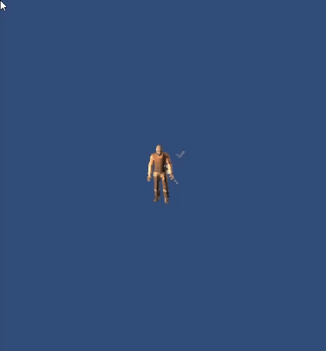

# 🧰 SpriteGen3D – 3D to 2D Sprite Animation Tool for Unity

`SpriteGen3D` is a Unity editor tool that lets you convert animated 3D models into 2D sprite sheets for use in top-down or isometric 2D games.

It captures your character's animation from **8 directions** — up, down, left, right, and diagonals — and exports **ready-to-use sprite sheets** for each direction. Ideal for RPGs, tactics games, or retro-inspired 2D titles that use 3D asset pipelines.

---

## ✨ Features

- 🎥 Convert 3D animated characters into directional 2D sprite sheets  
- 🧭 Supports 8-direction capture: up, down, left, right, and diagonals  
- 🎮 Use any 3D character with Animator and animation clips  
- 🖼️ Export frame-by-frame sprite sheets  
- ⚙️ Customize frame rate, resolution, duration, and output format  
- 🔁 Batch generate animations (walk, attack, cast, etc.)  

---

## 🎬 How It Works

1. Drop your animated 3D character prefab into the tool.  
2. Select an animation clip to render.  
3. Choose resolution and frame rate.  
4. Hit **Generate**, and the tool will capture the animation from all 8 directions.  
5. The final output is a set of 2D sprite sheets ready to use in your game.  

---

## 📽️ Full Demo Video

---

## 🖼️ Output Example

Below is an example is created using the generated sprite sheet from an animated 3D character:

---
